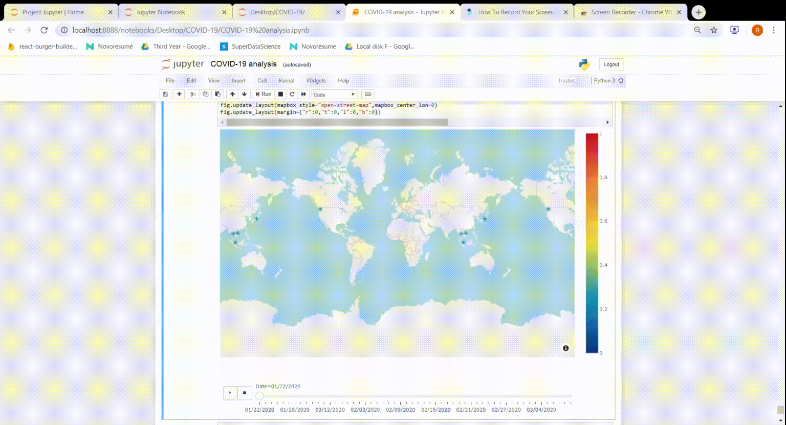

# COVID-19 Data Analysis project

The coronavirus or Covid-19 is a large family of viruses that causes illnesses ranging from the common cold to acute respiratory syndromes, but the current virus is a novel strain not seen before. Common symptoms of the novel coronavirus strain include respiratory symptoms such as fever, cough, and shortness of breath, according to the WHO. The WHO has declared the coronavirus epidemic as a global health emergency.

The affect of CoronaVirus globally can be found <a href="https://google.org/crisisresponse/covid19-map?hl=en">here</a>
### This project shows the affect of coronavirus in India as well as worldwide, highlighting the number of cases and their exponential growth. An in depth analysis and visualisation can be found in the COVID-19 analysis.ipnyb file.

## The following GIF shows the gradual spread of covid-19 worlwide through various months of Feb-March

## Growth of spread across nations
.png)

## An account of confirmed cases, recoveries and deaths
.png)

## Affected places in India
.png)

## An evaluation of case numbers in India
.png)

## - By Ruchi Mehta
